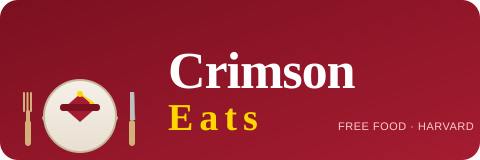

<p align="center">
  
</p>

# 🎓 Free Food at Harvard — Next 7 Days

> **September 8 – September 15, 2026** &nbsp;·&nbsp; Auto-updated daily via GitHub Actions &nbsp;·&nbsp; Last updated: **2026-09-08 12:52 ET**

---

### 📅 Subscribe to Calendar

```
https://raw.githubusercontent.com/thetaaaaa/CrimsonEats/main/events.ics
```

---

## Tuesday, September 8

| Time | Event | Food | Location | Source |
|------|-------|------|----------|--------|
| 12:20 PM – 1:15 PM | [Scripture in Community: Public Reading of Scripture](https://hls.harvard.edu/events/scripture-in-community-public-reading-of-scripture-4/?occurrence=12473) | Scripture in Community meets over lunch to read and listen to Bible passages together – from… | [Harvard Law School](https://www.google.com/maps/search/Harvard+Law+School,+Cambridge,+MA) | HLS |

## Tuesday, September 15

| Time | Event | Food | Location | Source |
|------|-------|------|----------|--------|
| 12:20 PM – 1:15 PM | [Scripture in Community: Public Reading of Scripture](https://hls.harvard.edu/events/scripture-in-community-public-reading-of-scripture-4/?occurrence=12474) | Scripture in Community meets over lunch to read and listen to Bible passages together – from… | [Harvard Law School](https://www.google.com/maps/search/Harvard+Law+School,+Cambridge,+MA) | HLS |
| 12:20 PM – 1:15 PM | [Tenant Advocacy Project Information Session](https://hls.harvard.edu/events/tap-information-session/) | Please join us for an outdoor information session and lunch | [Harvard Law School](https://www.google.com/maps/search/Harvard+Law+School,+Cambridge,+MA) | HLS |
| 12:30 PM – 1:15 PM | [OPIA’s 1L Job Search Strategy Session](https://hls.harvard.edu/events/opias-1l-job-search-strategy-session/) | Lunch provided | [Harvard Law School](https://www.google.com/maps/search/Harvard+Law+School,+Cambridge,+MA) | HLS |

---

**Sources monitored:**
- [Harvard Law School (HLS)](https://hls.harvard.edu/calendar/)
- [Fairbank Center for Chinese Studies (Fairbank Center)](https://fairbank.fas.harvard.edu/events/)
- [Institute for Quantitative Social Science (IQSS)](https://www.iq.harvard.edu/calendar)

*This page is generated automatically by [`harvard_food_events.py`](harvard_food_events.py). Run the script locally or let GitHub Actions update it daily.*

---

## ⚖️ Disclaimer

This project aggregates publicly available event information from official Harvard University calendars for student convenience. All content is sourced from and remains the intellectual property of Harvard University and its respective schools/centers.

**Non-commercial use only.** This is an independent student project, not officially affiliated with Harvard University. Always verify event details on official Harvard websites before attending.

**Liability:** Information is provided "as-is" without warranties. Events may change, be cancelled, or have restricted attendance. Project maintainers are not responsible for outdated information or event-related issues.

If Harvard University requests changes to this project, such requests will be honored promptly.
