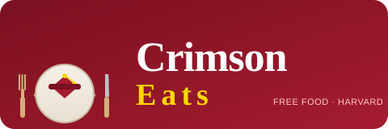

<p align="center">
  
</p>

# 🎓 Free Food at Harvard — Next 7 Days

> **October 3 – October 10, 2026** &nbsp;·&nbsp; Auto-updated daily via GitHub Actions &nbsp;·&nbsp; Last updated: **2026-10-03 12:48 ET**

---

### 📅 Subscribe to Calendar

```
https://raw.githubusercontent.com/thetaaaaa/CrimsonEats/main/events.ics
```

---

## Saturday, October 3

| Time | Event | Food | Location | Source |
|------|-------|------|----------|--------|
| 8:30 AM – 8:30 PM | [VthePeople](https://hls.harvard.edu/events/vthepeople-2/) | Trump Field Trip October 5 • 8:15 am - 10:00 am Fried Frank 1L Coffee Chat October 5 • 11:30 am - 1:30 pm Back to events list VthePeople: Am | [Harvard Law School](https://www.google.com/maps/search/Harvard+Law+School,+Cambridge,+MA) | HLS |
| 8:30 AM – 1:30 PM | [HELR First Subcite](https://hls.harvard.edu/events/helr-first-subcite/) | Trump Field Trip October 5 • 8:15 am - 10:00 am Fried Frank 1L Coffee Chat October 5 • 11:30 am - 1:30 pm Back to events list This is the fi | [Harvard Law School](https://www.google.com/maps/search/Harvard+Law+School,+Cambridge,+MA) | HLS |
| 3:00 PM – 5:00 PM | [Alumni in Residence with Sengal Selassie J.D./M.B.A. ’95 of Brightwood Capital Advisors, LLC](https://hls.harvard.edu/events/alumni-in-residence-with-sengal-selassie-j-d-m-b-a-95-of-brightwood-capital-advisors-llc-2/) | Trump Field Trip October 5 • 8:15 am - 10:00 am Fried Frank 1L Coffee Chat October 5 • 11:30 am - 1:30 pm Back to events list Friday, Octobe | [Harvard Law School](https://www.google.com/maps/search/Harvard+Law+School,+Cambridge,+MA) | HLS |

## Saturday, October 10

| Time | Event | Food | Location | Source |
|------|-------|------|----------|--------|
| 9:00 AM – 5:30 PM | [Celebrating the Scholarship and Legacy of Professor Elizabeth J. Perry](https://fairbank.fas.harvard.edu/events/celebrating-the-scholarship-and-legacy-of-professor-elizabeth-j-perry/) | Coffee Break Panel II: China in Comparative Perspective 11:10 a | Yenching Auditorium, 2 Divinity Ave. | Fairbank Center |

---

**Sources monitored:**
- [Harvard Law School (HLS)](https://hls.harvard.edu/calendar/)
- [Fairbank Center for Chinese Studies (Fairbank Center)](https://fairbank.fas.harvard.edu/events/)
- [Institute for Quantitative Social Science (IQSS)](https://www.iq.harvard.edu/calendar)

*This page is generated automatically by [`harvard_food_events.py`](harvard_food_events.py). Run the script locally or let GitHub Actions update it daily.*

---

## ⚖️ Disclaimer

This project aggregates publicly available event information from official Harvard University calendars for student convenience. All content is sourced from and remains the intellectual property of Harvard University and its respective schools/centers.

**Non-commercial use only.** This is an independent student project, not officially affiliated with Harvard University. Always verify event details on official Harvard websites before attending.

**Liability:** Information is provided "as-is" without warranties. Events may change, be cancelled, or have restricted attendance. Project maintainers are not responsible for outdated information or event-related issues.

If Harvard University requests changes to this project, such requests will be honored promptly.
